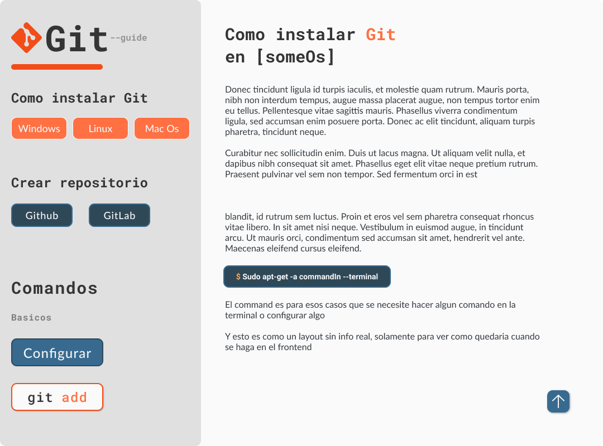

# 🌿 Git Basic Guide

### v0.1

## 🌐 About

Esta es una pequeña guia sobre los comandos basicos de git, esto es para aquellas personas que se les dificulta aprender algunos comandos sobre **Git**

Pero tambien puedes repasar lo que has aprendido o conocer mas cosas para tener un mejor manejo sobre el control de versiones

## 🔧 Contrubuir

Puedes contribuir al proyecto con un `pull request` al proyecto y con gusto revisaremos tu codigo para agregarlo a la rama `main`

Para hacer tu contribucion debe hacerse en una rama diferente a la de **main** y agregar las cosas ahi

Tambien puedes unirte a nuestra comunidad de Discord y conocer o colaborar con mas programadores y te puedes unir a mas proyectos para aprender mas cosas :D

### Importante

Puedes leer los Detalles en [/details](./DETAILS.md) para que tu **pull request** sea aceptado sin problemas :D

Los **pull request** seran revisados por algun miembro de la organizacion que aceptara estos cambios para la rama `main`

## 🚀 Discord: [callMeDev](https://discord.gg/RTdXPfbz3K)🌟

### Si quieres revisar las actividades a realizar o tareas pendientes, revisa la pestaña de [projects](https://github.com/callMe-Dev/git-guide/projects/1)
